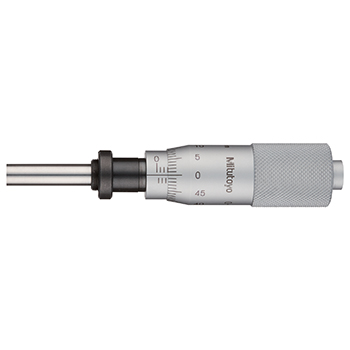

# Xylosome — Manufacturing Notes

## Surface Finish & Knurling

### Reference
Mitutoyo precision instruments — specifically the 150-195 micrometer head series.

- Thimble barrel: **fine straight (axial) knurl**
- Frame / body grip: **fine diamond knurl**
Both areas read as very fine, almost velvety grip — not aggressive.

### Knurl pitch specification
Reference image confirmed: Mitutoyo 150-195 micrometer head (0–25 mm).
Two distinct knurl zones observed:

**Zone 1 — Thimble barrel (rotating graduated section)**
| Parameter | Value | Notes |
|-----------|-------|-------|
| Pattern | **Straight / axial knurl** | Lines run parallel to spindle axis |
| Pitch | **~0.5–0.6 mm** (~40–50 TPI) | Fine, for thumb rotation control |
| Depth | Shallow ~0.15 mm | Not aggressive — smooth rotation feel |

**Zone 2 — End cap / body grip (large rear section)**
| Parameter | Value | Notes |
|-----------|-------|-------|
| Pattern | **Diamond knurl** (cross-hatch) | 30°/30° helix angle, 60° included |
| Pitch | **~0.6–0.8 mm** (~33–40 TPI) | Slightly coarser than thimble for grip |
| Standard | ASME B94.6 — **96 DP** instrument grade | Finest standard pitch before impractical |
| Depth | Shallow ~0.2 mm | Grip without sharpness |
| Tooth form | Flat-top preferred | Rounder, more comfortable than sharp-V |

> The diamond end cap is the dominant texture you feel in the hand — this is the target.
> 96 DP (≈ 0.4–0.5 mm metric pitch) is the ASME instrument-grade recommendation.
> Specify this explicitly to the machinist — most default to medium (33 TPI) if not told.

### Finish specification (in order of operations)

**⚠️ Order is critical — do not deviate.**

1. **Knurl (CNC / lathe)**
   - Pattern: **diamond cross-hatch**, 30°/30° helix, 60° included angle
   - Pitch: **0.6–0.8 mm** (~33–40 TPI) — fine instrument grade
   - Depth: 0.15–0.2 mm — shallow, flat-top teeth preferred
   - Knurling displaces and work-hardens the steel — must be done on bare metal
   - Light deburr pass after knurling, no sharp edges
   - *Cannot knurl after plating — chrome would crack and spall*

2. **Sandblast (matte)**
   - Glass bead or fine aluminium oxide, medium grit
   - Blast all external surfaces including knurled areas
   - Creates matte key for chrome adhesion and gives satin texture under plate
   - Result: uniform non-reflective surface — the chrome will read this texture through
   - *Cannot blast after chrome — would strip the plate*

3. **Chrome plate (decorative)**
   - Apply decorative chrome over the matte blasted surface
   - **Minimum thickness** — specify flash/decorative chrome only (0.01–0.03 mm max)
   - Thicker hard chrome build-up will fill and soften the knurl detail — avoid
   - The matte blast under chrome reads as "satin chrome" — bright but not mirror
   - This combination is what gives the Mitutoyo instrument appearance

### Notes for manufacturer / finisher
- Confirm plating thickness with vendor — ask specifically for minimum decorative flash
- Chrome adds 0.01–0.03 mm per surface — account for this if tolerances are tight
- Request a sample coupon through the full process (knurl → blast → chrome) before full run
- If vendor asks about masking: spindle bores and threaded areas should be masked before plating

### Pattern decision
**Diamond knurl only** — across all grip surfaces.
No straight/axial knurl. The diamond cross-hatch is the chosen finish for the Xylosome instrument feel.

### Feel target
Dense, even diamond cross-hatch. Fine pitch so it reads almost smooth visually but provides confident grip under the thumb. Mitutoyo 150-195 end cap is the physical reference — ask the machinist to handle one if possible.

---

## buttondial1 — Part-Specific Notes

Reference file: `buttondial1.step`

### Geometry summary
| Feature | Dimension |
|---------|-----------|
| Outer body diameter | **Ø30.0 mm** |
| Depth (front to back) | **19.5 mm** |
| Front face step | Ø30 → Ø24 mm recess |
| Counterbore (front) | **Ø10.3 mm** |
| Shaft bore (through) | **Ø6.38 mm** |
| Shaft fit | Sliding fit on shaft — locked by set screw |

### Set screw — M3
- **Thread:** M3 × 0.5 tapped hole, radial through the outer body wall
- **Position:** On the cylindrical band (Ø30 mm section), centred axially — drill and tap perpendicular to shaft axis
- **Depth:** Through to shaft bore — tip bears on shaft flat or OD
- **Flat on shaft:** ✅ Already designed in — set screw seats against the flat
- **Masking:** M3 hole must be masked before chrome plating — chrome in threads will seize the screw

### Knurling — outer band (Ø30 mm cylinder)
- **Pattern:** Diamond cross-hatch, 30°/30° helix, 60° included angle
- **Pitch:** **0.6–0.8 mm** (~33–40 TPI) — Mitutoyo 150-195 end cap standard
- **Depth:** 0.15–0.2 mm — shallow, flat-top teeth
- **Zone:** Full axial length of the Ø30 mm outer band only — do not knurl the stepped Ø24 mm recess or front/rear faces
- **Process order:** Knurl → sandblast → chrome plate (see finish spec above)

### Notes for machinist
- The shaft bore (Ø6.38 mm) and M3 tapped hole must be **masked before chrome plating**
- Knurl the outer band before any surface finishing
- The front face has a B-spline curved profile (dome/contour) — confirm with designer before machining if not already in STEP
- Request a test piece before full run to verify knurl feel against Mitutoyo reference
